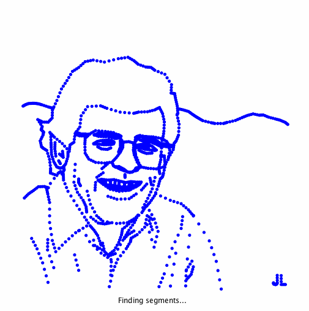

# Pattern Recognition

http://coursera.cs.princeton.edu/algs4/assignments/collinear.html

Programming Assignment 3 for the "Algorithms, Part I" course on Coursera.

[Problem specification](assignment/ProgrammingAssignment3_Specification.pdf) (Course starting date October 3rd, 2016).  
[Problem checklist](assignment/ProgrammingAssignment3_Checklist.pdf) (Course starting date October 3rd, 2016).

## The problem
Given a set of n distinct points in the plane, find every (maximal) line segment that connects a subset of 4 or more of the points.

### Visualization of running algorithms 
Bruteforce (left) and Fast (right) algorithm running on rs1423.txt:  

## For fun
As suggested [here](http://coursera.cs.princeton.edu/algs4/checklists/collinear.html) I created my own pattern recognition file starting from the custom Yoda input file I created for assignment 1.

The result of running pattern recognition on yoda-80-pattern.txt:  
  
The visualizer has been slightly modified here so that points are on top of segments for visibility.

## Assessment Summary
Compilation:  PASSED  
Style:        PASSED  
Findbugs:     No potential bugs found.   
API:          PASSED

Correctness:  41/41 tests passed  
Memory:       1/1 tests passed  
Timing:       10/41 tests passed  

Aggregate score: 81.10% [Correctness: 65%, Memory: 10%, Timing: 25%, Style: 0%]

------
(Note that for this project to work a reference to [algs4.jar](http://algs4.cs.princeton.edu/code/algs4.jar) has to be added.) 
